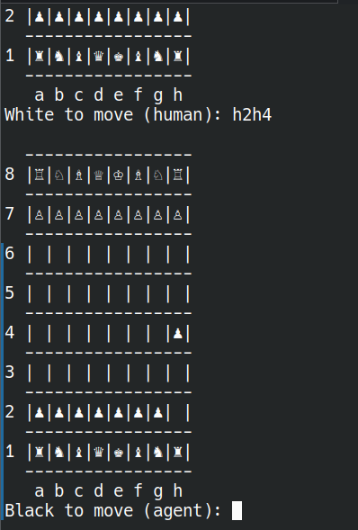

# Setting

I really like ML so I though maybe I could use supervised learning to train a chess engine. (I'm not a chess player btw).

The idea is that we use supervised learning to predict the advantage of the player to move. And the we can leverage this to identify good moves.

It's instructive from a theoretical side and while working on this problem there are some pitfalls and to be honest I didn't get through all of them. During training the models only see chess position (encoded of course) and the score (the advantage) of this position. It only learns to identify these good positions without learning any of the rules. This is actually fairly standard for ML, but it creates some problems with encouraging moves that lead to mates and not just to a strong position. The other problem is that it only learns from high level play, so it would be interesting to see if and how it can generalise this data to chess positions that appear in amateur play.

### Disclaimer

I had great plans for this, like being able to play against the derpy agents, which is kind of possible but it's not very convenient.

Also, I couldn't do proper fine-tuning or experiments with different neural network architectures, since training just takes too long, and I didn't have the time to wait for more epochs. 

**Heads-up**: There is no Docker nor cloud deployment 🚫.

# 1. Problem Description

I've got a dataset from Kaggle: https://www.kaggle.com/datasets/ronakbadhe/chess-evaluations.  
The dataset comes from this project: https://github.com/r2dev2/ChessDataContributor/tree/master, which collectively used Stockfish to analyse chess positions (it seems abandoned or should we say finished :D).

The data has only two fields:

- fen (string notation for chess positions)
- evaluation

What we basically want is to train a model that takes a FEN and turns that into an evaluation.

The ideal workflow is as follows:

```
Exploratory Data Analysis (EDA) + Feature Engineering
→ Try out neural networks with different loss functions, target transformations, and architectures
→ Train script with best parameters and ONNX export
→ Create a deployment script
```

# 2. Data Description

The column `fen` contains the [Forsyth–Edwards Notation](https://en.wikipedia.org/wiki/Forsyth%E2%80%93Edwards_Notation) of a chess position, which describes a chess position. An example of such a string looks like this:

`R1k5/8/1pK5/1r1P3p/P4r2/8/8/7r b - - 0 50`

The string consists of 6 parts separated by spaces. 

- 1.: The first part '`R1k5/8/1pK5/1r1P3p/P4r2/8/8/7r`' describes the board, which decodes to this:

- 2.: The second part of the string encodes whose turn it is. In our case it's `b` for black.
- 3.: and 4.:  The third and fourth parts encode en passant squares and castling rights. Here they are `-`, which means no en passant square and no castling rights.
- 5.: and 6.: The final two numbers are clocks. The last one is the total move clock, ticking up after both players have moved, and the other number is the half-move clock for pawn moves and captures. For details I refer to the Wikipedia article. What is important about the clocks is that they restrict the length of games, so even when two derpy neural networks play against each other, their match will eventually finish in a draw.

The other column, `evaluation`, shows a Stockfish evaluation of the position from White's perspective. It is a string, but semantically it is distinguished into *advantage* and a *mate counter*.

The evaluation is a mate counter when it starts with `#`. Then the next character is either a `+` or `-`, which indicates whether it's a forced mate for White or for Black. The number following the sign indicates how many moves it will take to mate. For example, `#-3` means that Black can mate in 3 moves. If the number is `0`, then the position describes a mate position. For example, in the picture above the evaluation is `#+0`, as it's a position in which Black is mated.

If the evaluation does not start with a `#`, it is the advantage of White. The more positive it is, the more White is winning. The more negative it is, the more Black is winning. An advantage of `0` means the position is even (most likely a draw). The advantage is actually measured in centipawns, but that doesn't matter here.

**Note**: If you are wondering where this silly chess position in the example above comes from: it's from a game between two derpy chess engines.

# 3. EDA and Feature Engineering Summary

EDA and data preparation were done in the notebook `notebooks/01_data_preparation.ipynb`.  
A big part of the EDA was finding out the conventions described in the previous section, although these are not present in the notebook anymore.

Mostly, the notebook is about data preparation. The two main parts are:
- changing the evaluation from _White's perspective_ to _the current player's perspective_ (more in the next section)
- turning `evaluation` into an `advantage` that takes extreme values if the evaluation is a mate in X
- identifying and removing identical positions under mirroring of the position

Mirroring a position means taking a position like this one (sorry for the messy position):


and basically swapping the roles:


The White player is now the Black player and vice versa, but both keep their positions and turns. A good evaluation should be invariant under mirroring. If White has `+100` centipawns in a position, then Black should have `+100` centipawns in the mirrored position.

There are also other things done in the notebook, but these are the main ones.

# 4. Modelling Approach & Metrics

### Target

The untransformed target distribution looks like this:


It looks so zoomed out because the tails are so far out and there is hugh spike at `0`. Most of the mass is concentrated around 0 but the huge outliers can make it hard for the model to learn, I think. So what I went with is a [arsinh](https://en.wikipedia.org/wiki/Inverse_hyperbolic_functions)-transformation, which keeps the values around `0` uncompressed but compresses the outliers.

But actually I'm not sure if that is the right approach. Half of the outliers are made by the Feature Engineering from the previous step, so that the models would see a significant difference in a position that is mate in 4 and mate in 3. I didn't have time to compare two models using the original target and the arsinh-transformed target.

### Loss for Training

Here my first choice is the Hubner-loss which is like MSE around 0 but L1 for big values. So basically arsinh and Hubner-loss are a one two punch to not punish extreme values too hard (again I don't know if this is the appropriate choice).

### Neural Network Architecture

The neural network models operate on tensors of shape `(15, 8, 8)`. The first channels encode the pieces (6 for White + 6 for Black), and then there are 3 more channels for castling rules and en passant. The remaining two channels describe the file and rank of the square.

For example, `board_array(0, 1, 1)` means that there is a White pawn on the square `b2` (I don't actually know if this exact position is correct, as it depends on the orientation, but as long as we use the same encoding function for training and deployment it's fine).

I don't know which neural network architecture is best for chess, so I just asked a LLM agent to give me three options (small, medium, big) and see which ones work best.

At one stage of the project I ran a fairly large run for small, medium and middle (but for a slightly different data set):

Run on the full training set:

| Architecture | Epochs | Training Time | Final Loss |
|---|---|---|---|
| small | 5 | 2.45 h | 0.55
| medium | 2 | 2.30 h | 0.34
| large | 5 | 10h | 0.30

We can see that medium is better than small. It has a smaller loss after less time. Also small cannot decrease it's loss below 0.55. I don't have a fair comparison between medium and large though in this run.

### Evaluation Metric

The metric for determining which model is best was kind of the most fun and the biggest letdown for me at the same time. Instead of using MSE, MAE, or any other metric for deciding which model is better, I just let them play against each other.

Even though they can only evaluate a position, we can use the evaluation to look ahead and decide on the value of a move. For example, in the starting position:


we can emulate all possible starting moves, get the advantage (by design this is the advantage of the Black player) for each resulting position, and choose the move that results in the smallest advantage for Black.

So in principle this is a great idea, but in practice it didn't really work. All models that I trained performed basically equally well. Why I think this is the case I'll explain in the last section about limitations.

# 5. How to run and what

I managed this project using `uv`. For this you should have a global installation of `uv`, and then run `uv sync` to install the dependencies.

If you use a different package manager, you have to install the packages from `pyproject.toml`.

If anything doesn't work properly, I already apologise — I didn't have time to clean up the repo (it's cluttered with Python files) nor test the setup from scratch.

## Running EDA and Data Preparation

First, download `chess-evaluation.zip` from Kaggle and unzip it into the `data` folder (you need an account for that; the data is too big to ship with the repo, sorry).  
Check that you now have `data/chessData.csv` (we don't need the other files in the zip).

Now you can open `01_data_preparation.ipynb` and run the cells (however you open Jupyter notebooks, make sure that you use the venv created with `uv` for the notebook).

## Tuning the Training

For this you can open `02_model_training.ipynb`. It uses the file `data/cleaned/chess_train_val_small.csv`, which is included in the repo (and was generated by the previous notebook).

Note that the training cells take quite a long time to execute, and the results themselves are not very expressive.

**Warning**: Training with the full dataset creates a 46GB temporary data to store the tensors.

## Run the Final Training

You have to run `final_fit.py` for this (in `uv`).

One way (on Linux) is:

Activate:
```bash
source .venv/bin/activate
python -m final_fit
```

This generates ONNX files in `models`. You can run `python -m src.final_fit --help` to see how to change the model architecture, how many epochs to run, and whether to use the small training data or the full dataset. (The full data is only available if you ran the data preparation notebook.)

## Running the Server Locally
```bash
uvicorn src.app:app --host 0.0.0.0 --port 8000
```

and you cen test it with these commands

#### Health
```bash
curl -X GET "http://localhost:8000/health"
```

#### Predict
```bash
curl -X POST http://localhost:8000/predict \
  -H "Content-Type: application/json" \
  -d '{"fen": "rnbqkbnr/pppppppp/8/8/8/8/PPPPPPPP/RNBQKBNR w KQkq - 0 1"}'

```

## Kind of playing against the model

When you run
```
python -m src.play
```

You can play againts an agent of your choice in the terminal. It's not very comfortable as you have to type in your moves like this `h2h4` or `Rb6` but it allows you to experience the agents for yourself.




## 7. Known Limitations / Next Steps

I said that comparing the different architectures/loss functions/targets was inconclusive. A next step would be to increase the size of the training data. The last training on the full training data showed quite interestingly that the 

First run
| Architecture | Epochs | Training Time | Final Loss |
|---|---|---|---|
| small | 5 | 2.45 h | 0.55
| medium | 2 | 2.30 h | 0.34
| large | 5 | 10h | 0.30

Second run

| Architecture | Epochs | Training Time | Final Loss |
|---|---|---|---|
| large | 1 | 2h | 0.38


So that speaks quite in favour of the medium model. I don't know though if that also translates in higher loss/win/draw rate, since I couldn't test this.

That also ties in with my biggest fear that it is really hard for these models to mate. The model is trained to evaluate good positions. But a position that creates a mate and a position that creates a mate a bit later might not be big of a difference advantage wise, both are basically winning positions. So the models might just orbit in the winning position without ever actually mating.

Obvious next steps would be a proper RL setup with selfplay and all the bells and whistles that I have avoided in this project.